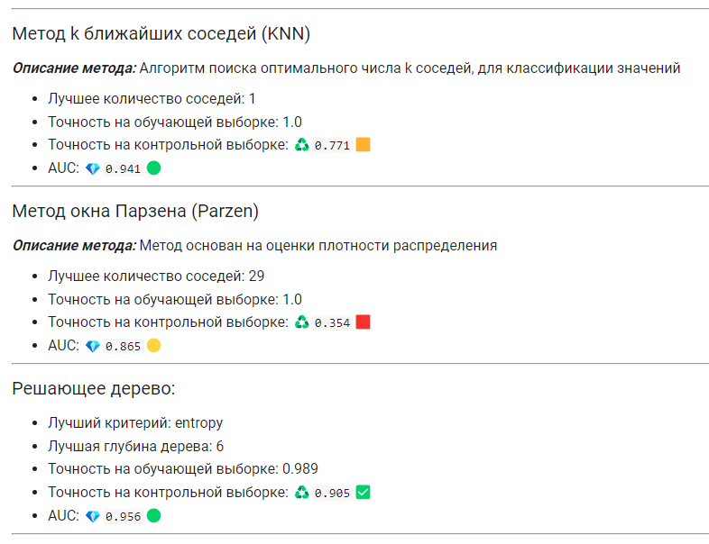
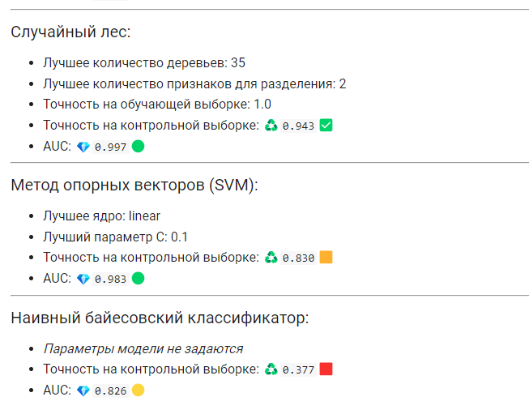
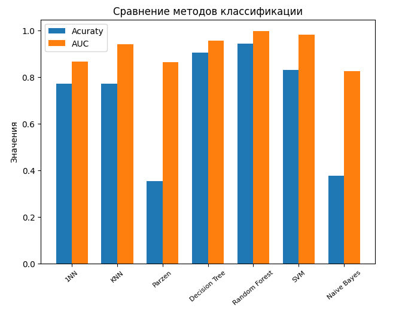
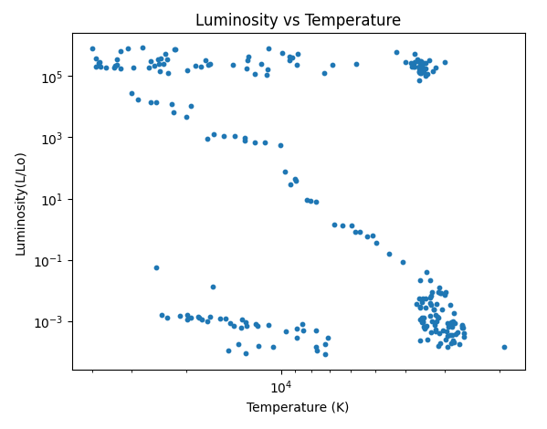
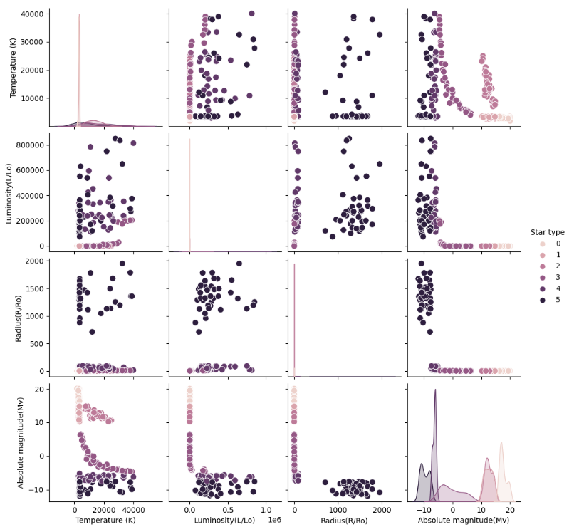
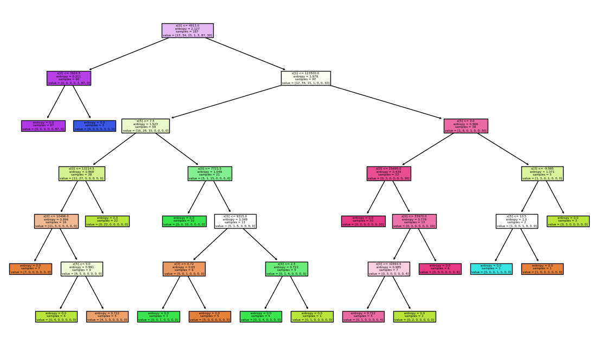
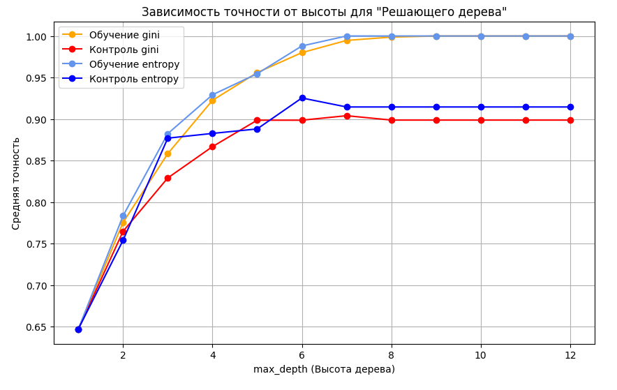
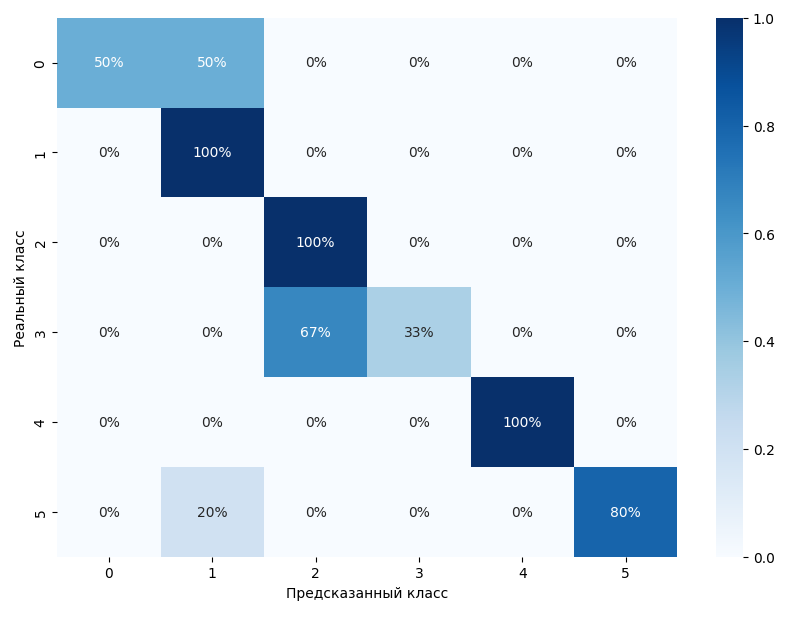

### 🌌 Учебный проект по работе с разными моделями нейросетей, для предсказания класса звезды по её другим входным данным

В этом проекте нас обучали использовать различные методы машинного обучения

---

Весь код и подробные объяснения каждому методу, хранятся в блокнотах Google Collab, вот ссылки на них:

Ссылка на все блокноты с решениями заданий:  
1 задание - Обзор датасета: https://colab.research.google.com/drive/1j3DZA69V8JkCy80a57nNYbM_AB5JY4sL?usp=sharing

2 задание - Метрические методы классификации (1NN, KNN и Parzen): https://colab.research.google.com/drive/1DAZ07DVkbamj-tXaVZAqO-NVkJq30_F-?usp=sharing

3 задание - Логические методы классификации (Решающее дерево и Случайный лес): https://colab.research.google.com/drive/1B59VMPmuVa51jVQRDRes_Vrnh4zs9wUt?usp=sharing

4 задание - Линейные методы классификации (Метод опорных векторов (SVM)): https://colab.research.google.com/drive/1AJWhvNxY3yKlJYyZGvkDmcXuOrFWbNQS?usp=sharing

5 задание - Обзор лучших методов: https://colab.research.google.com/drive/1eo6GeHt7wY7D9HZzaRHkNjGRr_CMMjva?usp=sharing

5_1 - Реализация наивного байесовского классификатора, а также построение матрицы ошибок, и ROC-кривой: https://colab.research.google.com/drive/1w2pCLSIH-wF4u2IroOjII9dDJYRsPkQp?usp=sharing

Ссылки на датасет:  
Чистый: https://disk.yandex.ru/d/fCdZbYI2_n9fYQ  
Обработанный (где все текстовые признаки заменены числами): https://disk.yandex.ru/d/MYcwhDNGgklyYg  

---

**Результаты использованных моделей:**

Схема распределения классов, в зависимости от температуры и светимости звезды:

Связки всех характеристик датасета:

Построение решающего дерева:

Оценка точности ответов модели:

